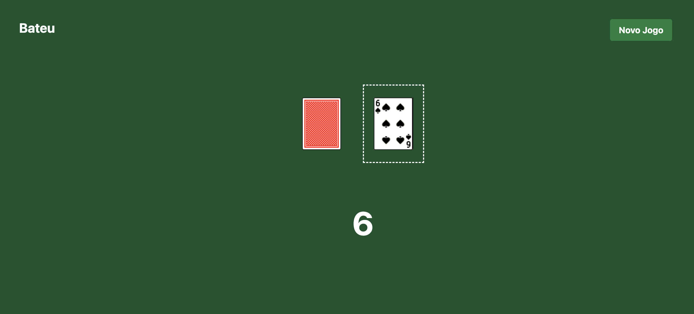

# Projeto Bateu

Este é um projeto da disciplina de Programação Orientada a Objetos (POO) do Senac.

## Instruções para baixar e rodar o projeto

### Pré-requisitos

- Git
- Java Development Kit (JDK) 8 ou superior
- IDE de sua preferência (Eclipse, IntelliJ, etc.)

### Passos para baixar o projeto

1. Clone o repositório para a sua máquina local:
    ```bash
    git clone https://github.com/seu-usuario/bateu.git
    ```

2. Navegue até o diretório do projeto:
    ```bash
    cd bateu
    ```

### Passos para rodar o projeto

1. Importe o projeto na sua IDE de preferência.

2. Compile o projeto.

3. Execute a classe principal `Main` para iniciar o programa.

### Classes do Projeto

#### Naipe

1. Crie um arquivo chamado `Naipe.java`
2. Defina a enumeração `Naipe` com os valores `COPAS`, `ESPADAS`, `OUROS` e `PAUS`.

#### Carta

1. Crie um arquivo chamado `Carta.java`.
2. Defina a classe `Carta` com os seguintes atributos privados:
    - `int numero`
    - `Naipe naipe`
3. Implemente um construtor que inicialize os atributos `numero` e `naipe`.
4. Implemente o método `getImagem` que retorna uma `String` com o caminho da imagem da carta.
5. Implemente o método `getNumero` que retorna o valor do atributo `numero`.

#### Baralho

1. Crie um arquivo chamado `Baralho.java`.
2. Defina a classe `Baralho` com o atributo privado:
    - `List<Carta> cartas`
3. Implemente um construtor que inicialize o baralho com todas as cartas de todos os naipes e números.
4. Implemente o método `comprar` que remove e retorna a primeira carta do baralho.
5. Implemente o método `embaralhar` que embaralha as cartas do baralho.
6. Implemente o método `getCartas` que retorna a lista de cartas do baralho.

#### Controller

Complete a classe Controller de acordo com as instruções dos comentários.